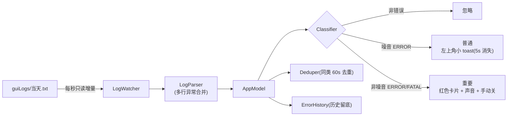

# V2rayN Sentinel(哨兵)


一个常驻 macOS 菜单栏的小工具:**实时监控本机 v2rayN 的日志输出,发现 error 就分级弹窗报警**。对 v2rayN 完全零侵入——只读它的日志,不改任何配置、不碰内核进程。

- **所有 error** → 屏幕**左上角小 toast**,自动消失、不打断当前操作。
- **重要 error** → **红色卡片 + 提示音 + 需手动关闭**,想漏看都难。
- 菜单栏常驻、可查最近错误全文、运行方式可选(开机自启 / 手动启动)。
- 原生 Swift,零第三方依赖,核心逻辑全部单测覆盖(49 个测试)。

> 版本 0.1.0 · 仅支持 macOS(Apple Silicon)· 需已安装并运行 [v2rayN](https://github.com/2dust/v2rayN)(macOS 版)

---

## 工作原理

v2rayN(macOS 版)会把界面/内核管理层的日志按天写到:

```
~/Library/Application Support/v2rayN/guiLogs/YYYY-MM-DD.txt
```

每行形如 `2026-07-02 09:42:43.3241-INFO 内容`,级别有 `INFO / DEBUG / ERROR`。Sentinel 每秒**只读增量**地 tail 当天这个文件,遇到 `-ERROR`/`-FATAL` 行就按规则分级并弹窗:



**「重要」怎么判定**:默认把已知噪音(mihomo 测速失败、订阅更新 bash 退出码 127)降级为「普通」,其余 `ERROR/FATAL` 一律视为「重要」。噪音规则和重要关键词都能在设置里自定义。

> 说明:v1 监控的是 guiLogs(内核崩溃、配置错误、进程异常退出、订阅失败等**真故障**)。xray 逐条连接日志(如"连接被拒/超时")默认走 v2rayN 的实时日志窗口、不落到此文件,属于后续扩展。

---

## 项目架构

分三层,UI 与逻辑彻底解耦,逻辑层不依赖任何 UI:

```
Sources/
├── SentinelCore/    # 纯逻辑,零 UI 依赖,全部单测覆盖
│   ├── LogLevel · LogRecord · LogParser        # 日志级别 + 多行记录解析
│   ├── LogFileLocator · WatchDecision · LogWatcher  # 定位当天文件、增量/跨天/截断决策、每秒轮询
│   ├── Classification · Classifier             # 噪音 / 普通 / 重要 分级
│   ├── Deduper                                 # 同类错误 60s 去重 + 过期清理
│   ├── Settings · SettingsStore                # 配置模型 + UserDefaults 持久化
│   └── HistoryEntry · ErrorHistory             # 错误历史环形缓存
├── AppLogic/        # UI 无关的协调层(可单测)
│   ├── Alerting                                # 弹窗/声音的抽象协议
│   └── AppModel                                # 分级 → 去重 → 报警 + 记历史
└── V2rayNSentinel/  # 菜单栏 App(AppKit + SwiftUI)
    ├── SentinelApp(@main) · Monitor           # 入口 + 每秒轮询接线
    ├── MenuContent · SettingsView             # 菜单栏下拉 + 设置界面
    ├── ToastView · ToastWindow · ToastManager # 左上角弹窗(NSPanel 浮窗)
    ├── ToastAlerter · SoundPlayer             # Alerting 落地 + 系统提示音
    └── LoginItemManager                       # 开机自启(SMAppService)
```

- **SentinelCore / AppLogic** 是两个 SwiftPM 库目标(纯逻辑,可 `swift test`)。
- **V2rayNSentinel** 是可执行目标,`LSUIElement` 菜单栏 App,不占 Dock。

---

## 环境要求

- **macOS 14(Sonoma)或更高**,Apple Silicon(发布二进制为 arm64)。
- 已安装并运行 **v2rayN(macOS 版)**。
- 从源码构建需 **Xcode / Swift 6 工具链**(`xcode-select --install` 或安装 Xcode)。

---

## 下载与安装

> 目前尚无预编译发布包,请从源码构建(过程很快,零第三方依赖)。**本机自己编译出的产物不带隔离标记(quarantine),可直接打开**,无需右键或去设置放行。

```bash
git clone https://github.com/wenzhurong/v2rayN-sentinel.git
cd v2rayN-sentinel
./scripts/make-app.sh          # 编译 release 并组装成 .app
open "build/V2rayN Sentinel.app"
```

产物在 `build/V2rayN Sentinel.app`,可拖到"应用程序"文件夹长期使用。

---

## 使用方法

1. 打开后它是**纯菜单栏 App**——没有 Dock 图标、没有窗口。去屏幕**右上角菜单栏**找**盾牌图标 🛡️**。
2. 启动即开始监控当天日志,采用「从末尾开始」策略:**不会回放历史旧错误**,只有启动之后**新出现**的错误才弹窗。
3. **报警表现**:
   - 普通 error → 左上角深色小 toast,默认 5 秒后淡出;点一下即关。
   - 重要 error → 左上角**红色卡片**,播放提示音,**必须点 ✕ 关闭**才消失。
4. 点菜单栏盾牌图标:
   - **监控中 / 已暂停** —— 点击切换。
   - **最近错误** —— 列出近期错误,点条目可**复制全文**(toast 会截断/消失,这里留底)。
   - **设置…** / **退出**。

### 设置项

| 选项 | 默认 | 说明 |
|---|---|---|
| 开机自启 | 关 | 用 SMAppService 注册登录项(未签名时可能注册失败,见下) |
| 重要错误播放声音 | 开 | |
| 提示音 | `Basso` | 从系统音列表选择 |
| 普通 toast 停留 | 5 秒 | 1–30 |
| 同类去重冷却 | 60 秒 | 5–600,同类错误在窗口内只弹一次 |
| 噪音规则(降级为普通) | mihomo 测速 / bash 退出码 127 | 每行一条正则,可增删 |
| 重要关键词(强制升级) | 空 | 每行一条;命中即升为「重要」 |

---

## 开发

```bash
swift build          # 构建
swift test           # 运行全部单测(49 个)
./scripts/make-app.sh   # 打包成 .app
```

- 逻辑层遵循 **TDD**:`SentinelCore` 的解析、定位、增量读取/跨天/截断、分级、去重、设置、历史,以及 `AppLogic` 的协调器 `AppModel`,均有先行失败测试。
- `scripts/feed-log.sh <目录> [important|ordinary]` 可向指定目录灌一条测试日志行,配合(配置模型里的)`logDirOverride` 指向临时目录做安全冒烟,不碰真实日志。

设计与实现计划见 [`docs/superpowers/specs/`](docs/superpowers/specs/) 与 [`docs/superpowers/plans/`](docs/superpowers/plans/)。

---

## 安全性:会不会影响 v2rayN?

**不会。** Sentinel 是一个**独立、无特权、纯被动只读**的进程,和 v2rayN 之间除了"只读它的日志"没有任何共享状态:

- 只读打开日志(`FileHandle(forReadingFrom:)`),**不加任何锁**,不会阻塞 v2rayN 写日志;句柄每次轮询开→读→关。
- **从不写/删/改** v2rayN 的任何文件,不碰内核配置(`binConfigs/`)。
- **不派生进程、不发信号、不用 sudo、不联网、不绑定端口**——碰不到 xray/sing-box 的运行与端口。
- 登录项只注册它**自己**;即使 Sentinel 崩溃,v2rayN 也完全不受影响。

---

## 分发给他人(签名说明)

本项目**未做代码签名**。自己本机构建、自己用不受影响。若要**发给别人**:

- **从源码构建**(推荐给技术同事):对方 `git clone` 后自行 `make-app.sh`,本地产物无隔离标记,直接可开。
- **直接发 .app**:对方从下载/AirDrop/邮件拿到会带隔离标记,较新 macOS 需在「系统设置 → 隐私与安全性 → 仍要打开」放行,或先 `xattr -dr com.apple.quarantine "V2rayN Sentinel.app"`。
- **想双击即开、体面分发**:需 Apple Developer ID 证书($99/年)签名 + 公证(Notarization)。「开机自启」在签名+公证后最稳。

---

## 路线图 / 已知限制

- [ ] 设置界面暴露 `logDirOverride`(当前仅在配置模型中,未接入 UI)。
- [ ] 纳入 xray/sing-box 连接级错误(连接被拒/超时)。
- [ ] 通知中心横幅作为可选报警渠道。
- [ ] Developer ID 签名 + 公证,提供可直接双击的发布包。

---

## 许可

本项目采用 [GNU General Public License v3.0](LICENSE)。
